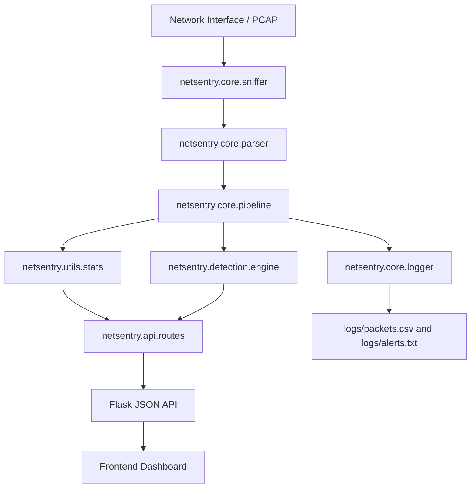

# NetSentry: Local Network Threat Monitor & Packet Intelligence

Python-based network monitoring and threat triage dashboard built with Scapy, Flask, and a custom Tailwind UI.


## Overview
NetSentry captures network packets, parses them into structured records, runs lightweight intrusion-detection rules, and serves the results through a live dashboard.

The project is designed to be:
- practical enough to monitor local traffic
- polished enough for GitHub and portfolio demos
- modular enough to extend with databases, auth, cloud storage, or more detection logic later

## Current Highlights
- Live packet monitoring pipeline using Scapy
- Stateful threat detection for port scans, SYN floods, ICMP floods, and sensitive-port access
- Page-style dashboard navigation for:
  - `Overview`
  - `Traffic Feed`
  - `Threat Triage`
  - `Report`
- Interactive header controls:
  - notification bell for live alert popover
  - download menu for TXT and JSON reports
- Report viewer with switchable `TXT` and `JSON` preview modes
- Scrollable report pane for large outputs
- Protocol distribution, traffic volume, top IPs, top ports, and session summaries
- Packet inspector and recent packet feed
- PCAP replay support using the same processing pipeline as live capture

## Technical Flow


## Project Structure
| Module | Responsibility |
| :--- | :--- |
| `netsentry.core` | Packet capture, parsing, logging, and shared pipeline logic |
| `netsentry.detection` | Threat detection, posture scoring, flow tracking, and risk scoring |
| `netsentry.api` | Flask routes that transform live state into dashboard-ready JSON |
| `netsentry.utils` | Config, filtering, and packet statistics |
| `netsentry.reports` | TXT/JSON security summary generation |
| `frontend/index.html` | Main dashboard UI |
| `main.py` | App entry point for live capture and PCAP replay |

## Dashboard Views
The Flask dashboard now behaves more like a small multi-page console than one long scrolling page.

### Overview
- KPI cards
- protocol distribution
- traffic volume
- top source IPs
- top destination ports

### Traffic Feed
- recent packet feed
- top 5-tuple sessions
- packet inspector

### Threat Triage
- live alert cards
- Risk IQ panel
- top risky hosts

### Report
- readable security summary
- switchable TXT / JSON preview
- downloadable report files

## Detection Rules
- `SENSITIVE_PORT_ACCESS`
  - flags suspicious access attempts to ports like FTP, SSH, Telnet, SMB, and RDP
- `PORT_SCAN`
  - detects many unique destination ports hit by a single source in a short window
- `SYN_FLOOD`
  - detects unusually high TCP SYN activity
- `ICMP_FLOOD`
  - detects abnormal ICMP volume
- `HIGH_TRAFFIC`
  - flags volume spikes from a single source

## Reports
The dashboard supports a readable security summary report and structured JSON output.

- `GET /api/report`
  - returns the report payload plus readable summary text
- `GET /api/report?download=true&format=text`
  - downloads a TXT report
- `GET /api/report?download=true&format=json`
  - downloads a JSON report

## How Data Is Stored
NetSentry currently uses a mix of in-memory state and local log files.

### In Memory
- live counters and protocol totals
- active flow state
- threat/risk scoring state
- posture calculation

### On Disk
- `logs/packets.csv`
- `logs/alerts.txt`
- generated report files inside `logs/`

This makes the current version easy to run locally, while still leaving room for a future database upgrade such as MongoDB.

## How to Run

### Option 1: Live Dashboard
```bash
python main.py
```

Then open:
```text
http://127.0.0.1:5001
```

### Option 2: Use a Specific Interface
If auto-detect does not capture on your machine, specify the adapter explicitly:

```bash
python main.py --interface "Wi-Fi"
```

### Option 3: Replay a PCAP
```bash
python main.py --pcap-file sample.pcap
```

### Option 4: Save Captured Traffic to PCAP
```bash
python main.py --save-pcap
```

or:

```bash
python main.py --save-pcap logs/session_capture.pcap
```

### Optional Streamlit View
```bash
python -m streamlit run streamlit_app.py
```

## Testing
```bash
python -m pytest tests/
```

## Important Note About Live Capture
The dashboard UI can be fully live, but real packet updates still depend on local capture setup.

On Windows, successful live capture may require:
- running the terminal as Administrator
- using the correct network interface explicitly
- having packet-capture support installed and working properly

If live capture is unavailable, the dashboard and API can still be developed, tested, and demonstrated using replayed or previously logged packet data.

## Roadmap Ideas
- MongoDB-backed packet and alert storage
- alert history and acknowledgment workflow
- auth and shared dashboards
- live websocket updates instead of polling
- exportable screenshots and session snapshots
- richer threat analytics and anomaly baselines

## Status
This repository currently focuses on:
- strong local demo value
- understandable backend structure
- clean dashboard UX
- incremental path toward a more production-style monitoring platform

## Dashboard Screenshots

### Overview


### Traffic Feed


### Threat Triage


### Report


---
Built for security demos, portfolio presentation, and practical network-monitoring experimentation.
